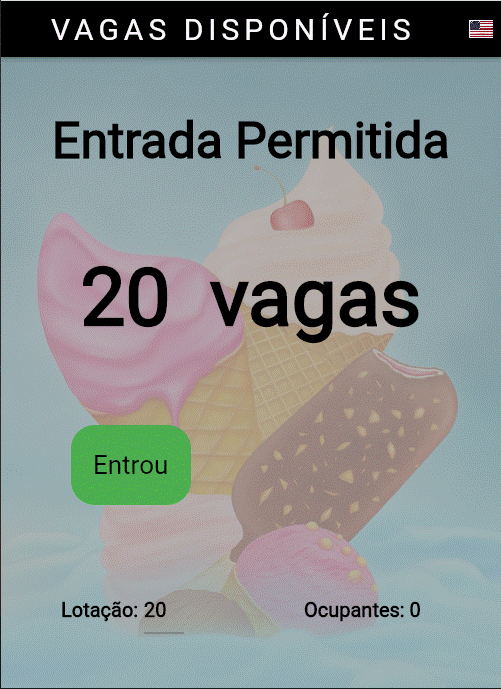
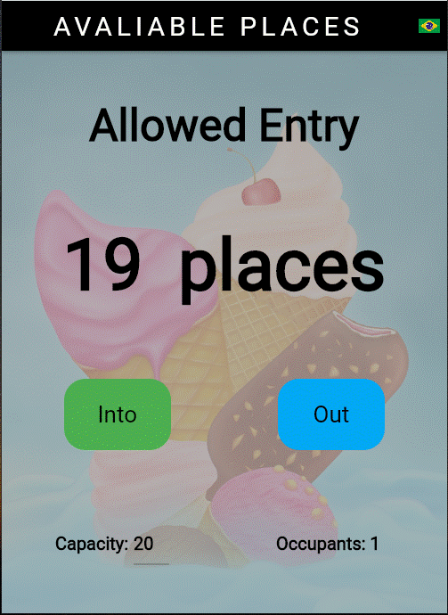
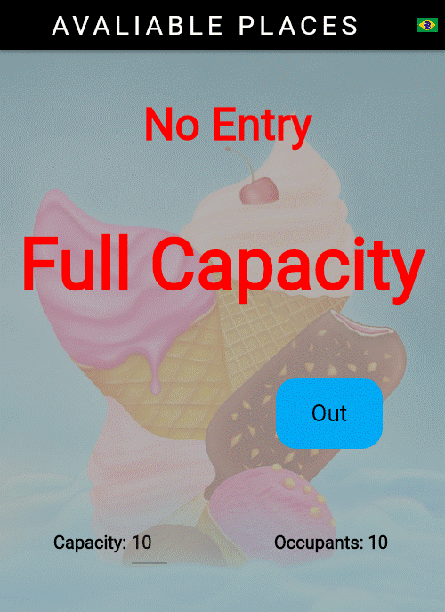

# **Una aplicación simple para contar personas en Flutter**

  

# Sobre
> La aplicación controla la entrada y salida de personas en una sala con aforo limitado.
> Básicamente, la aplicación puede fijar la capacidad de personas en un ambiente, mostrando la ocupación actual y las vacantes restantes, simplemente presionando los botones de "entrada" o "salida".
>
> [Basado en el curso Daniel Ciolfi en Udemy](https://www.udemy.com/share/101Wim3@bL2WBnXJOyqEFUkkRTTFBdyhqzpZ32Q6N7CTpyPFdVlf_9YG0WhJUuuvZelTMLrW/)
>
>  

# Aspectos
> - Controla con solo dos botones.
> - Línguas utilizadas: português o inglês.
> - Cambia el idioma presionando el botón de la bandera.
> - La capacidad de la habitación se puede cambiar en cualquier momento.
> - Muestra principalmente las vacantes restantes en la sala.
> - Muestra, secundariamente, el número de ocupantes. 

# Layouts
>
> ## Página de inicio en ingles:
> 
>
> ## Página de inicio en portugués:
> 
>
> ## Después de presionar el botón "into" por primera vez:: (en)
> 
>
> ## Cambiar la capacidad de la habitación en cualquier momento: (en)
> 
>
> ## Finalmente, al alcanzar la capacidad de la sala: (en)
> 
>

# Tecnologías
> - Dart Language
> - Flutter Framework
> - I10n package

# Ejecutando la aplicación
> - Compilar para android o ios o web o windows.
> - instalar y ejecutar.

# Versión Pro
> - Aplicación multiusuario.
> - Controle la entrada y salida a través de múltiples puntos de entrada y salida.
> - Otros idiomas además del portugués e inglés.
> - Configura libremente el fondo.
> - Muchas otras configuraciones además de los dispositivos de seguridad y registro.

# Author
> Pedro Vitor Abreu
>
> <soft.pva@gmail.com>
>
> <https://github.com/softpva>
>