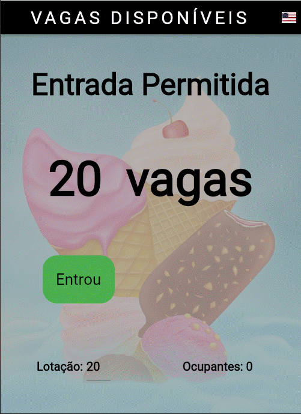
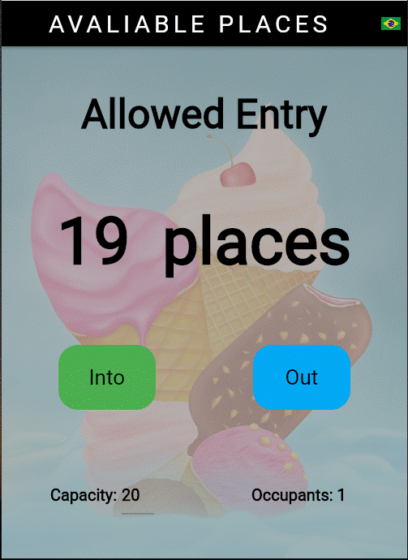
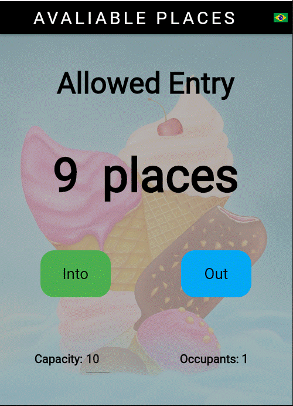
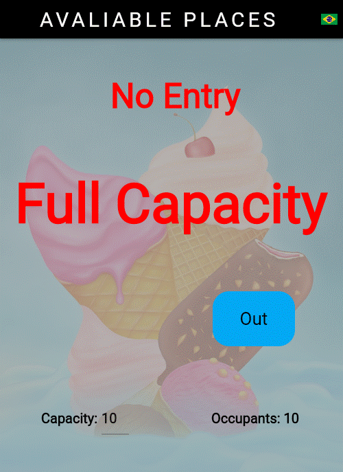

# **A Simple Flutter Counter People App.**

  

# About
> Counter people app controls people entry/exit a capacity-constrained room.
> Basically, the application can fix the amount of people in a restricted capacity environment, showing the current occupancy of the room and the remaining vacancies in it, just by pressing the "into" or "out" buttons.
>
> [Based on Daniel Ciolfi's udemy course](https://www.udemy.com/share/101Wim3@bL2WBnXJOyqEFUkkRTTFBdyhqzpZ32Q6N7CTpyPFdVlf_9YG0WhJUuuvZelTMLrW/)
>
>  

# Features
> - Simple control with two buttons.
> - Languages: English or Portuguese.
> - Change the language by pressing the flag button.
> - The room capacity can be changed at any time.
> - Shows mainly the occupancy of the room.
> - Secondarily show room vacancies. 

# Layouts
>
> ## The start page for English user
> 
>
> ## The start page for Portuguese user:
> 
>
> ## After pressing the "into" button for the first time:
>
> 
>
> ## Change room capacity at any time:
> 
>
> ## Finally, reaching the room full capacity:
> 
>

# Tecnologies
> - Dart Language
> - Flutter Framework
> - I10n package

# Kick off
> - Compile to android or ios or web or windows.
> - Install and run.

# Pro version
> - Multi-user application
> - Controls the entry/exit of people through various entry and exit points.
> - Set other languages.
> - Input any backgoud pictures.
> - Many other configuration, security and logging features.

# Author
> Pedro Vitor Abreu
>
> <soft.pva@gmail.com>
>
> <https://github.com/softpva>
>