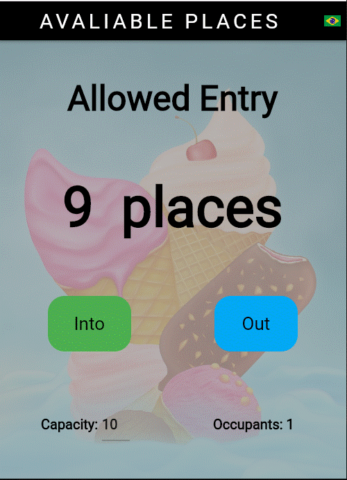

# **Um Simples App de Contagem de Pessoas em Flutter**

  

# Sobre
> O aplicativo controla a entrada e saida de pessoas em um ambiente com capacidade limitada.
> Basicamente, o aplicativo pode fixar a capacidade de pessoas em um ambiente, mostrando a presente ocupação e as vagas remanescentes, bastando pressionar os botões "entrou" ou "saiu".
>
> [Baseado no curso de Daniel Ciolfi na Udemy](https://www.udemy.com/share/101Wim3@bL2WBnXJOyqEFUkkRTTFBdyhqzpZ32Q6N7CTpyPFdVlf_9YG0WhJUuuvZelTMLrW/)
>
>  

# Aspectos
> - Controle com apenas dois botões.
> - Línguas utilizadas: português ou inglês.
> - Troque a língua pressionando botão-bandeira.
> - A capacidade da sala pode ser alterada a qualquer tempo.
> - Mostra, principalmente, as vagas remanescentes no ambiente.
> - Mostra, secundariamente, a quantidade de ocupantes. 

# Layouts
>
> ## Página inicial em inglês:
> 
>
> ## Página inicial em português:
> 
>
> ## Após pressionar o botão "entrou" pela primeira vez: (en)
> 
>
> ## Altere a capacidade da sala a qualquer tempo: (en)
> 
>
> ## Finalmente, ao atingir a capacidade da sala: (en)
> 
>

# Tecnologias
> - Dart Language
> - Flutter Framework
> - I10n package

# Rodando o app
> - Compile para android ou ios ou web ou windows.
> - Instale and rode.

# Pro version
> - Aplicação multiusuário.
> - Controla a entrada e saída através de vários pontos de entrada e saída.
> - Outras línguas, além do português e do inglês.
> - Configure livremente a tela de fundo.
> - Muitas outras configurações, além de dispositivos de segurança e de registro.

# Author
> Pedro Vitor Abreu
>
> <soft.pva@gmail.com>
>
> <https://github.com/softpva>
>